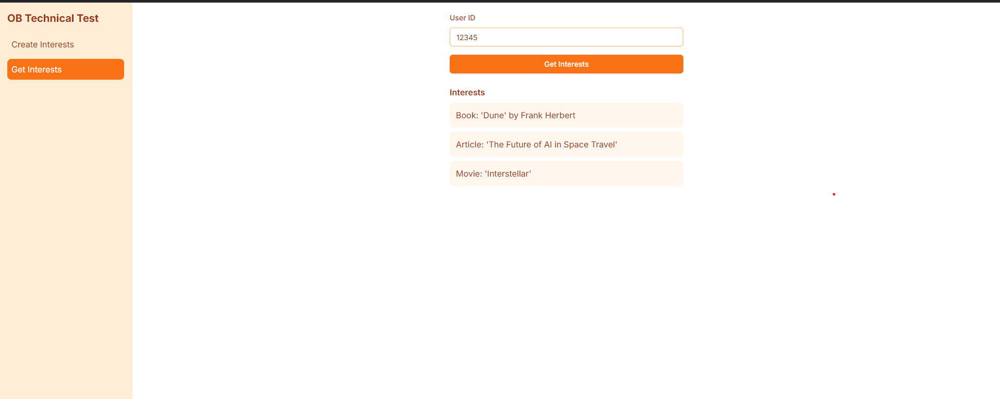
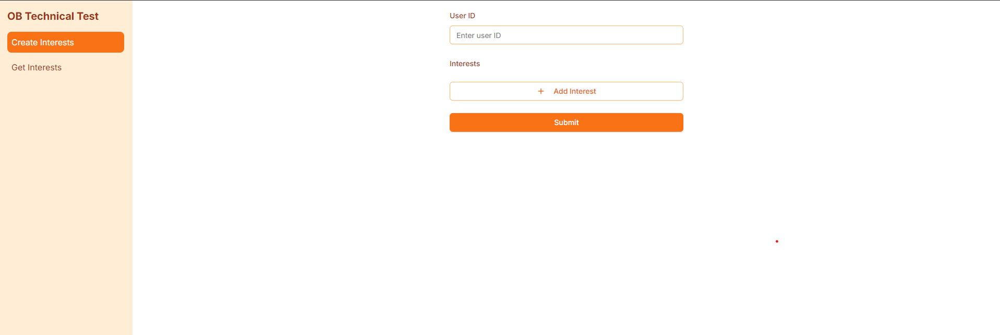

# Full-Stack Application

This is a full-stack application with a **Next.js** frontend and a **Node.js** backend. The project uses **Yarn** as the package manager.


---

## Folder Structure

```plaintext
.
├── frontend/   # Next.js application
├── backend/    # Node.js backend server
├── mockserver/    # Mock server
├── wiremock/    # Wire Mock server
```
````

---

## Prerequisites

Before running the application, ensure the following are installed on your system:

- [Node.js](https://nodejs.org/) (LTS version recommended)
- [Yarn](https://yarnpkg.com/)

---

## Getting Started

### 1. Clone the Repository

```bash
git clone <repository-url>
cd <repository-folder>
```

### 2. Install Dependencies

Run the following commands in the **root directory** of the project:

#### Frontend

```bash
cd frontend
yarn install
```

#### Backend

```bash
cd ../backend
yarn install
```

---

## Development

### Start the Frontend

Navigate to the `frontend` folder and start the Next.js development server:

```bash
cd frontend
yarn dev
```

By default, the frontend will run on `http://localhost:3000`.

### Start the Backend

Navigate to the `backend` folder and start the backend server:

```bash
cd ../backend
yarn dev
```

By default, the backend will run on `http://localhost:8000`.

---

### Start Mock Server

```bash
docker compose up
```

By default, the backend will run on `http://localhost:8000`.

---

## Production Build

### Frontend

To create a production build for the frontend:

```bash
cd frontend
yarn build
yarn start
```

### Backend

To run the backend in production mode:

```bash
cd ../backend
yarn build
yarn start
```

---

## Environment Variables

Both the frontend and backend require environment variables. Create `.env` files in their respective directories and configure them as needed.

### Example `.env` for Frontend:

```env
NEXT_PUBLIC_SERVER_URL=http://localhost:3000
```

### Example `.env` for Backend:

```env
PORT=8000
MONGODB_URL=mongodb://localhost:27017/mydb
LLM_URL=http://localhost:8080
```

---

## Scripts

### Frontend Scripts

| Script       | Description                  |
| ------------ | ---------------------------- |
| `yarn dev`   | Start the development server |
| `yarn build` | Create a production build    |
| `yarn start` | Start the production server  |

### Backend Scripts

| Script       | Description                      |
| ------------ | -------------------------------- |
| `yarn start` | Start the backend server         |
| `yarn build` | Build the backend for production |
| `yarn test`  | Test the api endpoint            |


## License

This project is licensed under the [MIT License](LICENSE).

---
